# git下载与GitHub注册
https://git-scm.com/?utm_source=chatgpt.com
https://github.com/?utm_source=chatgpt.com

# 一、Git 和 GitHub 是什么

* **Git（工具）**：就像是单机游戏里的“存档管理器”。它在你的电脑本地运行，帮你记录代码的每一次修改、每一个版本。
* **GitHub（平台）**：就像是“游戏云端存档中心”。它是一个网络平台，让你把本地的存档传到云端，方便备份或者和队友一起联机（协同开发）。


---

# 二、下载安装 Git

## 1. 打开 Git 官网

[Git 下载页面](https://git-scm.com/download/win?utm_source=chatgpt.com)

下载：

```txt id="h7x2za"
64-bit Git for Windows Setup
```

---

# 三、安装 Git（重点）

安装时：

## 一路 Next 即可

只改一个地方：

---

## PATH 环境变量（重点）

看到：

```txt id="uq08h4"
Adjusting your PATH environment
```

选择：

```txt id="x6p3of"
Git from the command line and also from 3rd-party software
```

意思：

> 直接把 Git 加入系统环境变量

这样：

* cmd 能用 git
* PowerShell 能用 git
* VSCode 能用 git
* 后面不用再手动配置环境变量

---

# 四、验证 Git 是否安装成功

安装完成后：

打开：

```txt id="w0rj2v"
cmd
```

输入：

```bash id="q0m65j"
git --version
```

看到：

```txt id="mmsi7l"
git version 2.xx.x
```

说明安装成功。

---

# 六、注册 GitHub

## 打开 GitHub

[GitHub 官网](https://github.com?utm_source=chatgpt.com)

注册：

* 邮箱
* 用户名
* 密码

建议：

* 用户名用英文
* 后续会成为你的项目地址

例如：

```txt id="z1v5fk"
https://github.com/用户名
```

---

# 七、配置 Git（第一次必须做）

打开：

* CMD
* PowerShell
* VSCode终端
  都可以。

---

## 设置用户名

```bash id="a4q6m5"
git config --global user.name "你的名字"
```

例如：

```bash id="xwjlwm"
git config --global user.name "xiaoming"
```

---

## 设置邮箱（用你注册GitHub的邮箱）

```bash id="0mlmjlwm"
git config --global user.email "你的邮箱"
```

例如：

```bash id="dy19gr"
git config --global user.email "123@qq.com"
```

---

## 查看配置（看看你的用户名和密码有没有配置错）

```bash id="1vrxnp"
git config --list
```

---

# 八、配置 GitHub SSH（推荐）

现在 GitHub 基本不用密码推送了。

推荐 SSH。

---

## 生成 SSH Key
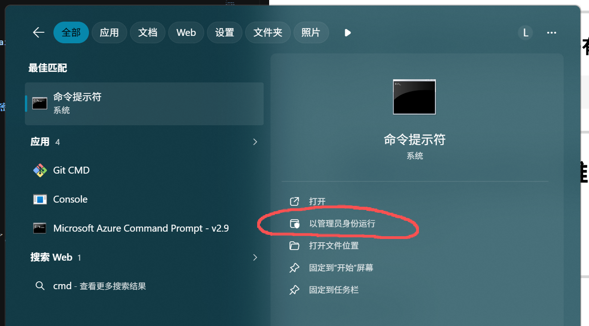
输入：

```bash id="hyhn5t"
ssh-keygen -t ed25519 -C "你的GitHub邮箱"
```

例如：

```bash id="mt4snm"
ssh-keygen -t ed25519 -C "123@qq.com"
```

---

## 一路回车

生成位置：

```txt id="0mr4dh"
C:\Users\用户名\.ssh
```

---

## 查看公钥

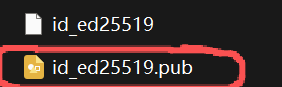

打开文件后复制全部内容。

---

# 九、添加 SSH Key 到 GitHub

打开设置：

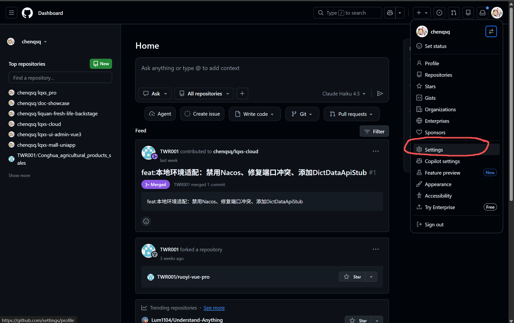

---

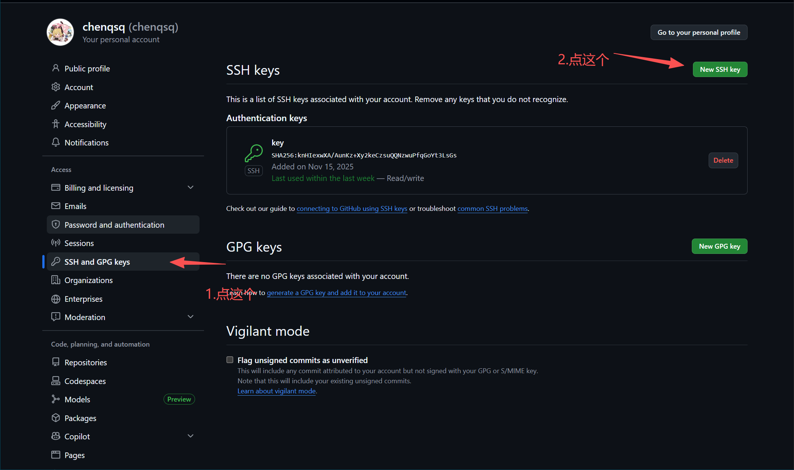

## 把你刚刚复制到的ssh密钥粘贴到这里面
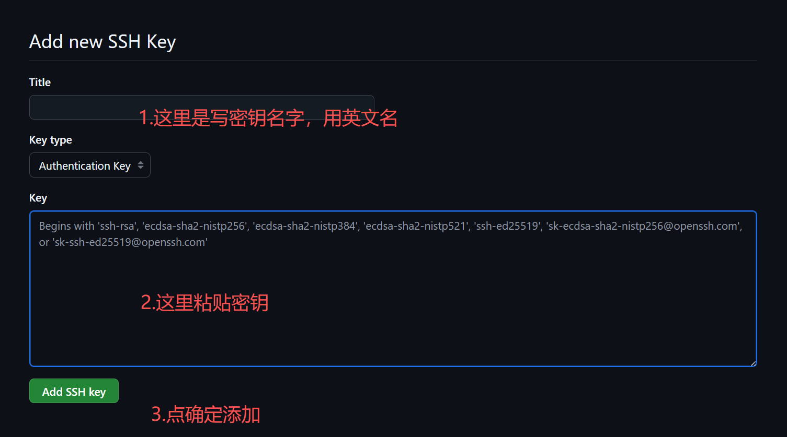

---

# 十、测试 SSH 是否成功

输入：

```bash id="7wx4i8"
ssh -T git@github.com
```

第一次输入：

```txt id="jlwmna"
yes
```

成功后会看到：

```txt id="1u8jlwm"
You've successfully authenticated
```

---

# 十一、创建 GitHub 仓库

GitHub 首页：


---


---

# 十二、克隆仓库到本地

复制仓库 SSH 地址：


---

自己新建一个文件夹，然后打开终端：

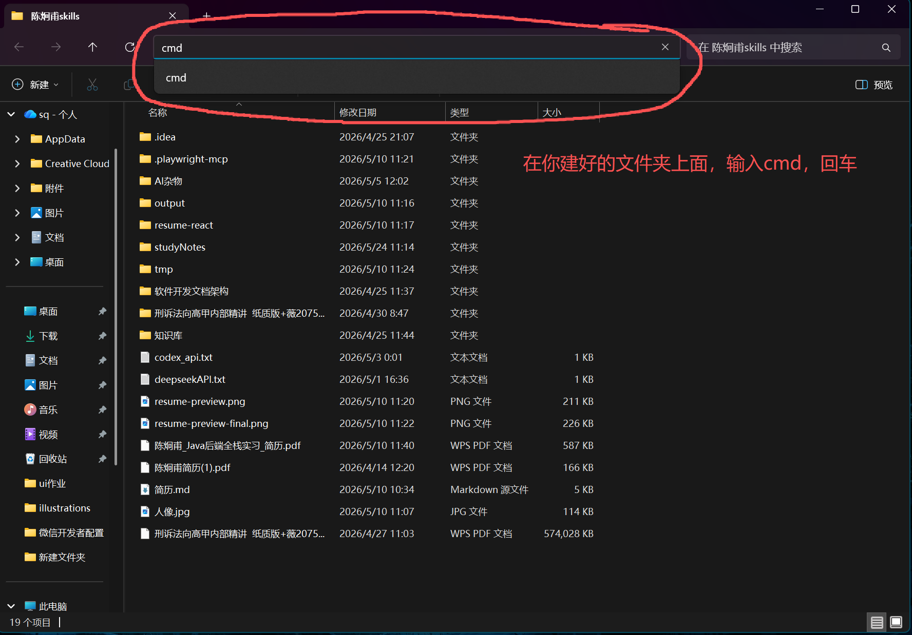

```bash id="8b6y8o"
git clone 仓库地址(刚刚复制的)
```
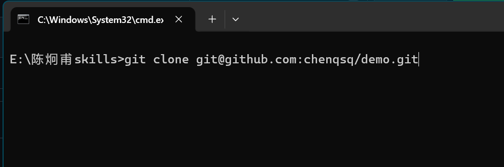

这样子就算成功了


在文件夹找到你的仓库
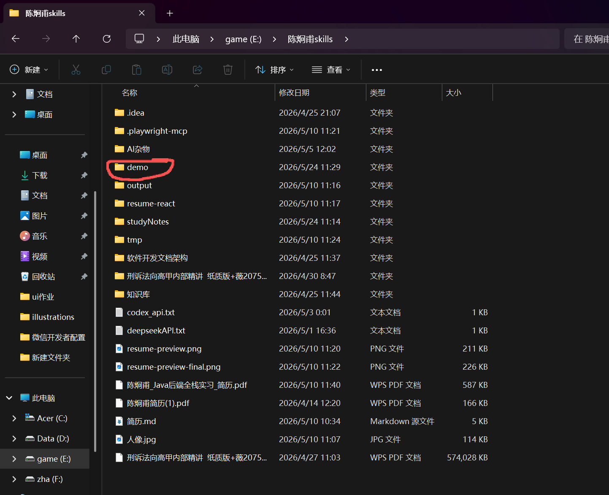
---

## 用vscode进入项目：
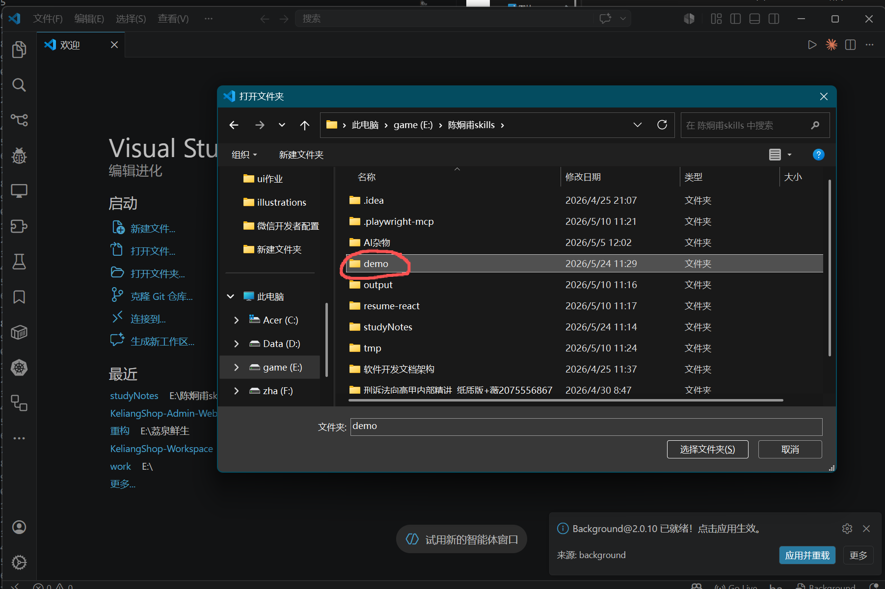


---

# 十三、Git 基础工作流（核心）


##  一、Git 基础命令

| 功能     | 命令                   | 作用            |
| ------ | -------------------- | ------------- |
| 查看版本   | `git --version`      | 查看 Git 是否安装成功 |
| 初始化仓库  | `git init`           | 创建 Git 仓库     |
| 克隆仓库   | `git clone 仓库地址`     | 下载远程仓库        |
| 查看状态   | `git status`         | 查看文件修改状态      |
| 添加全部文件 | `git add .`          | 添加所有修改        |
| 提交代码   | `git commit -m "说明"` | 提交版本          |
| 推送代码   | `git push`           | 上传代码到 GitHub  |
| 拉取代码   | `git pull`           | 拉取远程最新代码      |
| 查看历史   | `git log --oneline`  | 查看提交记录        |

---

##  二、Git 分支命令（重点）

| 功能        | 命令                    | 作用           |
| --------- | --------------------- | ------------ |
| 查看分支      | `git branch`          | 查看本地分支       |
| 查看远程分支    | `git branch -r`       | 查看远程分支       |
| 查看所有分支    | `git branch -a`       | 查看本地+远程      |
| 创建分支      | `git branch dev`      | 创建 dev 分支    |
| 切换分支      | `git checkout dev`    | 切换到 dev      |
| 创建并切换     | `git checkout -b dev` | 创建并切换分支      |
| 新版切换分支    | `git switch dev`      | 切换分支（新版推荐）   |
| 创建并切换（新版） | `git switch -c dev`   | 创建并切换        |
| 删除分支      | `git branch -d dev`   | 删除分支         |
| 强制删除      | `git branch -D dev`   | 强制删除分支       |
| 合并分支      | `git merge dev`       | 合并 dev 到当前分支 |

---

## 三、最标准的企业开发流程

---

## 1. 克隆项目

```bash id="n0e8v8"
git clone 仓库地址
```
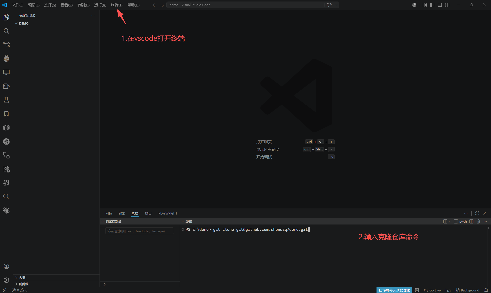

---

## 2. 用终端进入项目/用vscode的打开文件夹(教程上面的步骤有)

```bash id="4utp2l"
cd 项目名
```
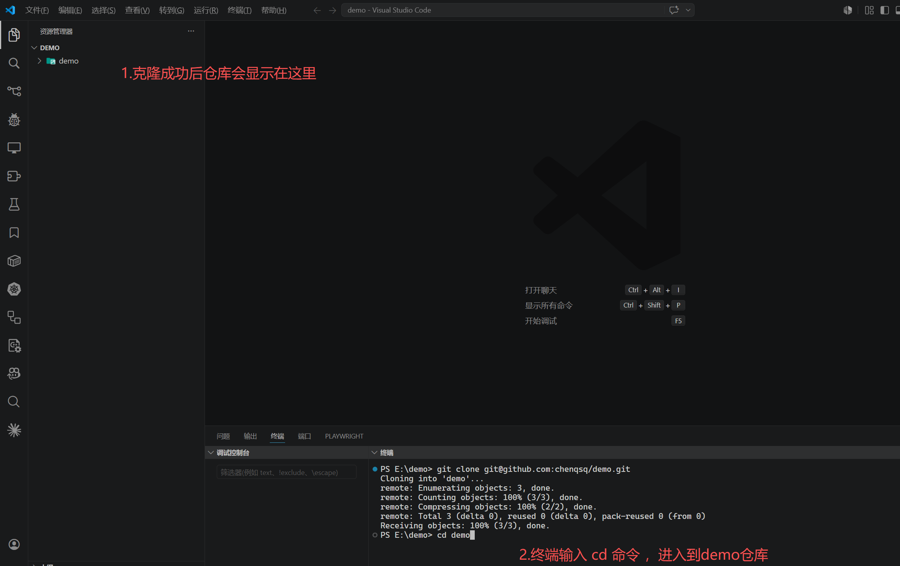
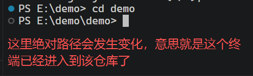

---

## 3. 在仓库查看当前分支

```bash id="7g4t3y"
git branch
```
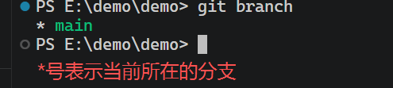

---

## 4. 创建功能分支

例如开发登录功能,输入这个命令后可以切换到该功能分支：

```bash id="g7f1qv"
git checkout -b 分支名(英文)
```

或者新版：

```bash id="jlwmu8"
git switch -c 分支名(英文)
```

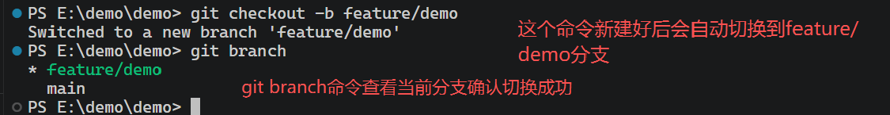

---

## 5. 开发代码

修改文件后你vscode会有提示
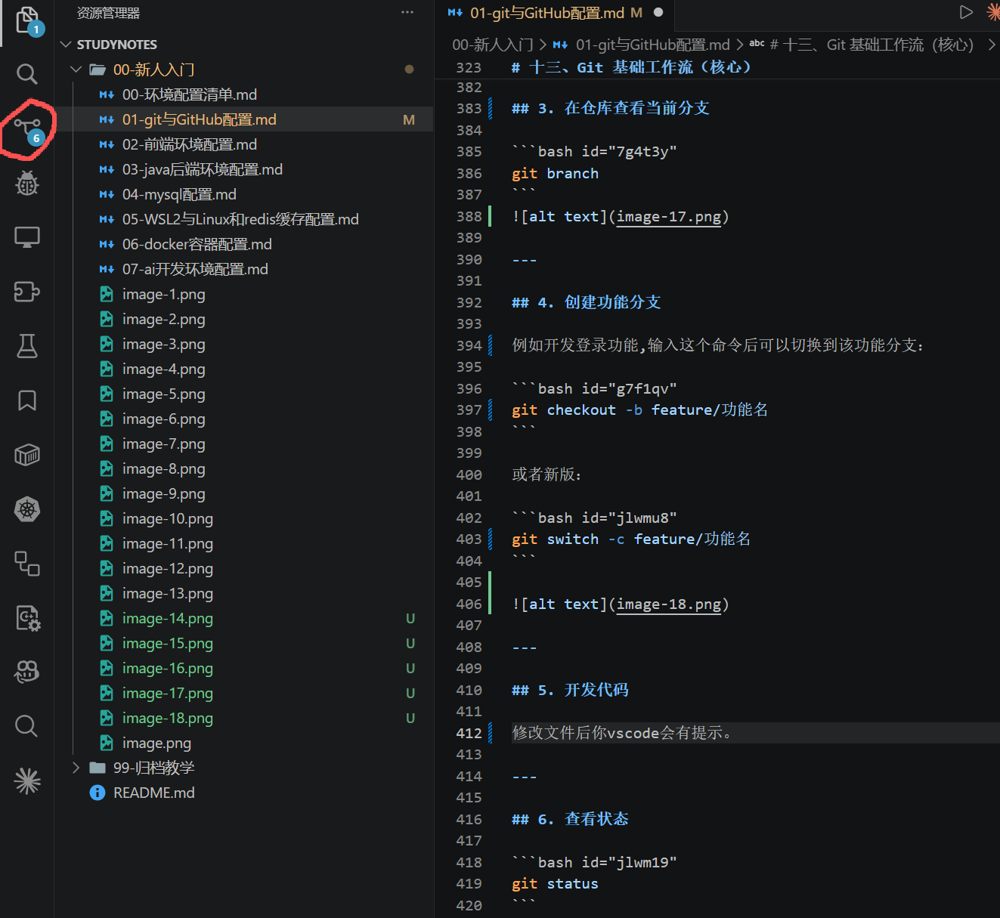

---

## 6. 暂存所有改动的代码/文件

```bash id="4iwnc0"
git add .
```
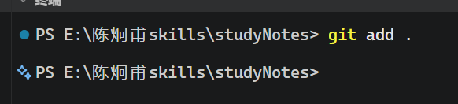
输入命令后这里会显示暂存你的代码修改
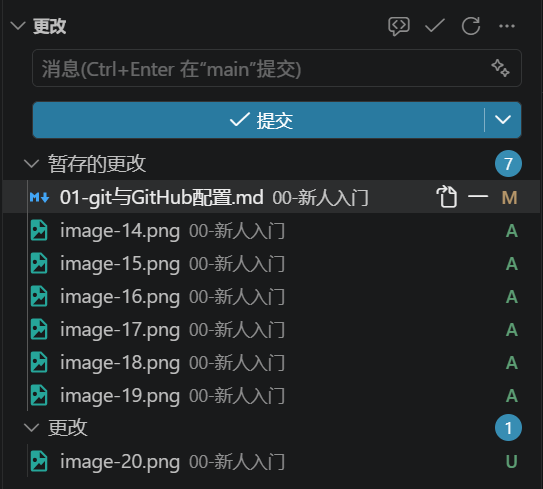
---

## 7. 提交代码

```bash id="jlwmc7"
git commit -m "双引号里面描述你改动的具体内容"
```
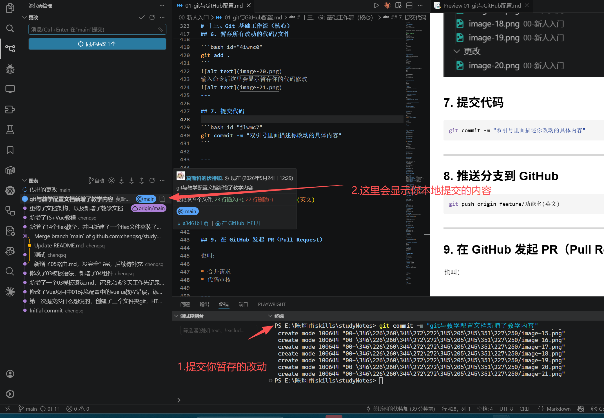
---

## 8. 把你当前要推送的分支，推送分支到 GitHub 远程仓库

```bash id="jlwm85"
git push origin 分支名(英文)
```
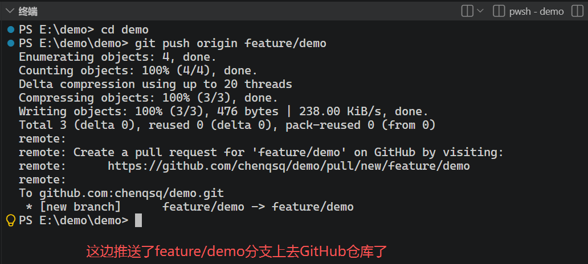
---

## 9. 在 GitHub 发起 PR（Pull Request）

也叫：

* 合并请求
* 代码审核

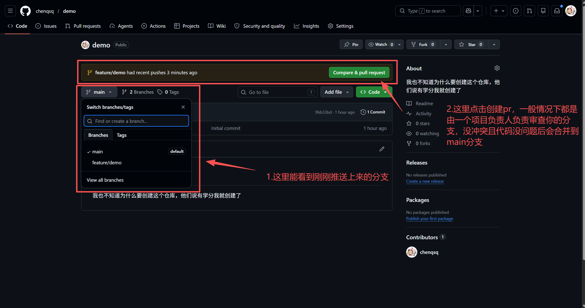
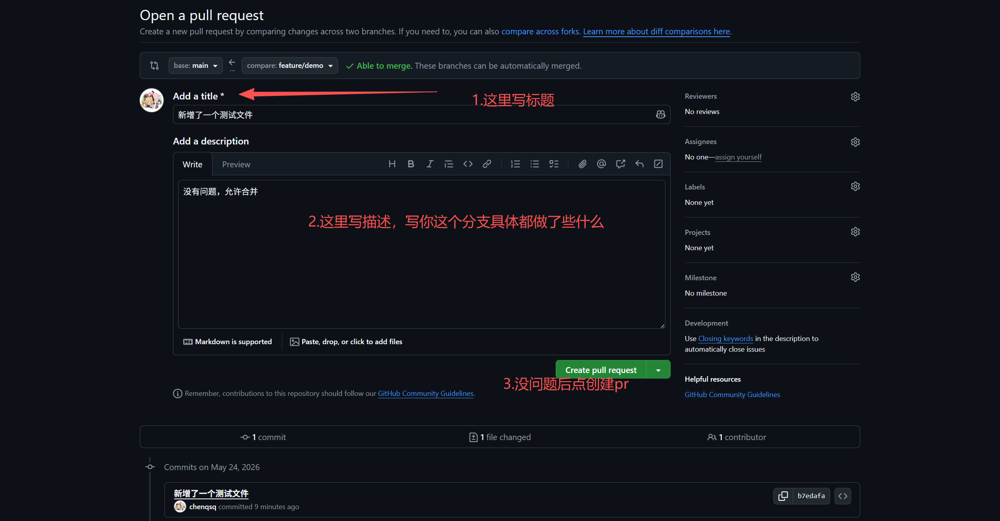
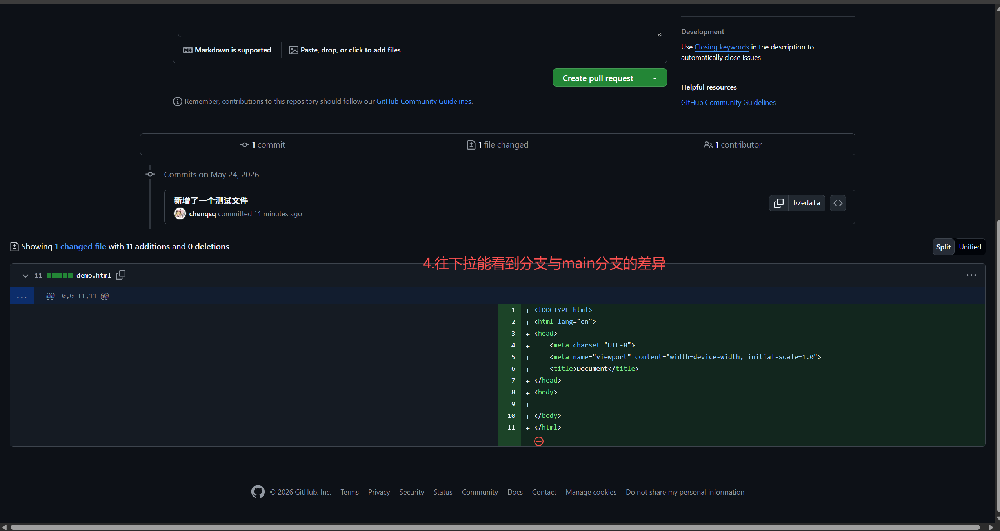
---

## 10. 合并到 main

项目负责人审核后：

```txt id="jlwmzi"
feature/login
→ main
```
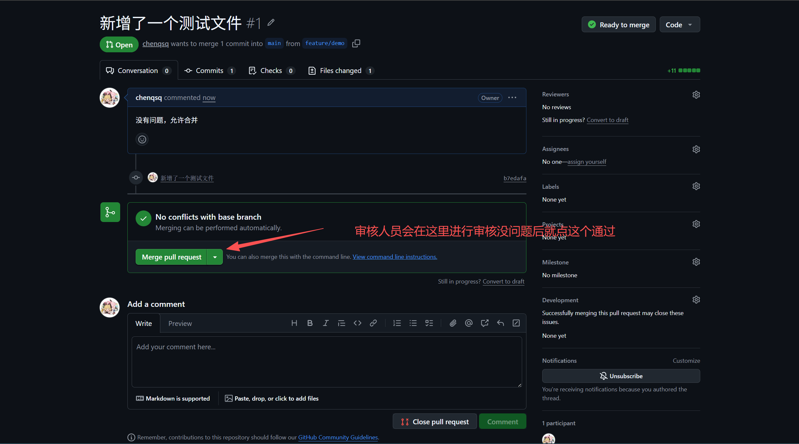
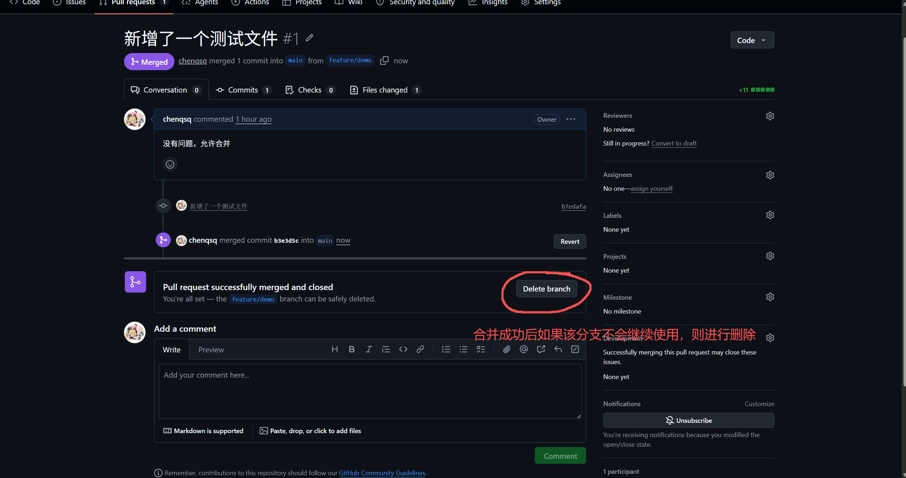

---

# 四、分支规范（非常重要）

## 主分支

| 分支     | 作用   |
| ------ | ---- |
| `main` | 生产环境 |
| `dev`  | 开发环境 |

---

## 功能分支（用feature/作为前缀）

| 分支              | 作用   |
| --------------- | ---- |
| `feature/login` | 登录功能 |
| `feature/user`  | 用户模块 |
| `feature/pay`   | 支付功能 |

---

## 修复分支

| 分支             | 作用       |
| -------------- | -------- |
| `hotfix/login` | 紧急修复登录问题 |

---

# 七、新人必须理解的 Git 思维

##  思维总览图（一图看懂 Git 全链路）

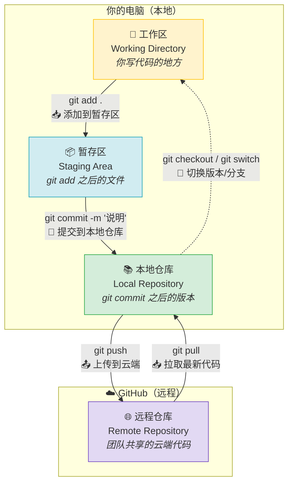
```mermaid
flowchart TB
    subgraph LOCAL[" 你的电脑（本地）"]
        direction TB
        WD["📁 工作区<br/>Working Directory<br/><i>你写代码的地方</i>"]
        SA["📦 暂存区<br/>Staging Area<br/><i>git add 之后的文件</i>"]
        LR["📚 本地仓库<br/>Local Repository<br/><i>git commit 之后的版本</i>"]
    end

    subgraph REMOTE["☁️ GitHub（远程）"]
        RR["🌐 远程仓库<br/>Remote Repository<br/><i>团队共享的云端代码</i>"]
    end

    WD -->|"git add .<br/>📥 添加到暂存区"| SA
    SA -->|"git commit -m '说明'<br/>💾 提交到本地仓库"| LR
    LR -->|"git push<br/>📤 上传到云端"| RR
    RR -->|"git pull<br/>📥 拉取最新代码"| LR
    LR -.->|"git checkout / git switch<br/>🔄 切换版本/分支"| WD

    style WD fill:#fff3cd,stroke:#ffc107,color:#333
    style SA fill:#d1ecf1,stroke:#17a2b8,color:#333
    style LR fill:#d4edda,stroke:#28a745,color:#333
    style RR fill:#e2d9f3,stroke:#6f42c1,color:#333
```

---

##  核心思维一：三区模型（最重要的概念）

新人最容易迷惑的就是 Git 的「三个区域」：

| 区域 | 命令 | 说明 |
|------|------|------|
| **工作区** | 写代码 | 你正在修改的文件 |
| **暂存区** | `git add` | 标记哪些文件要纳入下一次提交 |
| **版本库** | `git commit` | 生成一个版本快照，永久保存 |

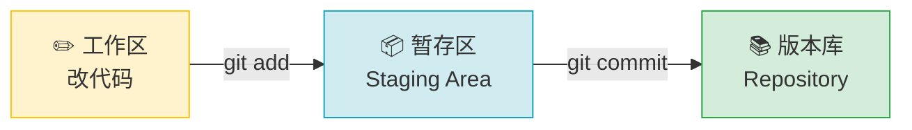
```mermaid
flowchart LR
    A["✏️ 工作区<br/>改代码"] -->|"git add"| B["📦 暂存区<br/>Staging Area"]
    B -->|"git commit"| C["📚 版本库<br/>Repository"]
    
    style A fill:#fff3cd,stroke:#ffc107
    style B fill:#d1ecf1,stroke:#17a2b8
    style C fill:#d4edda,stroke:#28a745
```

> ⚠️ **关键理解**：`git add` 和 `git commit` 是两步，缺一不可！
> - 只 `git add` 不 `git commit` = 文件标记了但还没生成版本记录
> - 直接 `git commit` 不 `git add` = 没有文件被暂存，commit 不会包含任何改动

---

##  核心思维二：分布式协作（本地 ↔ 远程）

Git 是**分布式**版本控制，每个人都有完整的仓库副本。

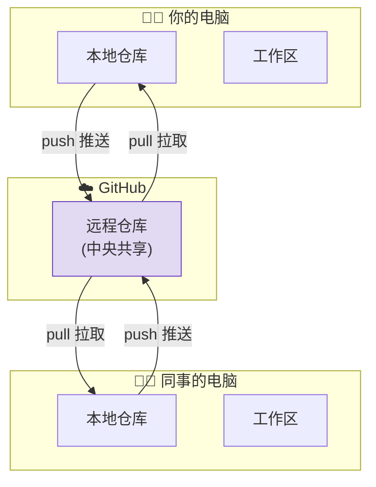
```mermaid
flowchart TB
    subgraph A["👨‍💻 你的电脑"]
        A1["本地仓库"]
        A2["工作区"]
    end
    
    subgraph B["☁️ GitHub"]
        B1["远程仓库<br/>(中央共享)"]
    end
    
    subgraph C["👩‍💻 同事的电脑"]
        C1["本地仓库"]
        C2["工作区"]
    end

    A1 -->|"push 推送"| B1
    B1 -->|"pull 拉取"| A1
    B1 -->|"pull 拉取"| C1
    C1 -->|"push 推送"| B1

    style B1 fill:#e2d9f3,stroke:#6f42c1,color:#333
```

>  **一句话总结**：
> - `push` = 把你的代码**分享**给团队
> - `pull` = 把团队的代码**同步**到本地

---

##  核心思维三：分支开发（互不干扰的平行宇宙）

分支让你可以**安全地实验**，不影响主代码。

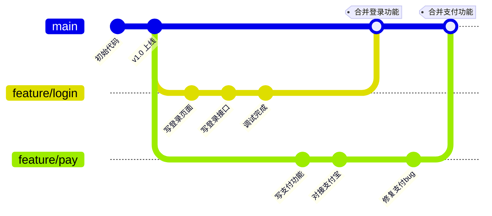
```mermaid
gitGraph
   commit id: "初始代码"
   commit id: "v1.0 上线"
   branch feature/login
   checkout feature/login
   commit id: "写登录页面"
   commit id: "写登录接口"
   commit id: "调试完成"
   checkout main
   branch feature/pay
   checkout feature/pay
   commit id: "写支付功能"
   commit id: "对接支付宝"
   checkout main
   merge feature/login tag: "合并登录功能"
   checkout feature/pay
   commit id: "修复支付bug"
   checkout main
   merge feature/pay tag: "合并支付功能"
```

>  **分支思维核心**：
> - `main` 分支 = 稳定版本（永远可运行）
> - `feature/xxx` 分支 = 开发新功能（坏了大不了删掉重来）
> - 开发完 → 测试通过 → 合并回 `main`

---

##  核心思维四：完整开发链路（每天做的事）

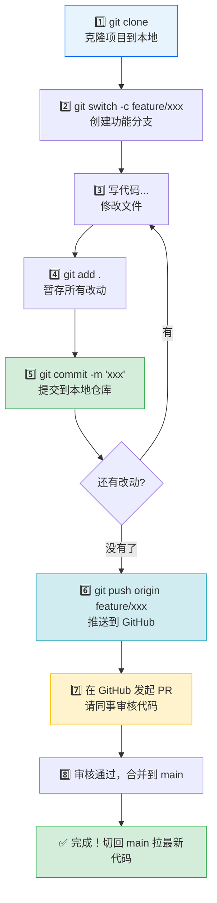
```mermaid
flowchart TD
    S1["1️⃣ git clone<br/>克隆项目到本地"] --> S2["2️⃣ git switch -c feature/xxx<br/>创建功能分支"]
    S2 --> S3["3️⃣ 写代码...<br/>修改文件"]
    S3 --> S4["4️⃣ git add .<br/>暂存所有改动"]
    S4 --> S5["5️⃣ git commit -m 'xxx'<br/>提交到本地仓库"]
    S5 --> S6{"还有改动?"}
    S6 -->|"有"| S3
    S6 -->|"没有了"| S7["6️⃣ git push origin feature/xxx<br/>推送到 GitHub"]
    S7 --> S8["7️⃣ 在 GitHub 发起 PR<br/>请同事审核代码"]
    S8 --> S9["8️⃣ 审核通过，合并到 main"]
    S9 --> S10["✅ 完成！切回 main 拉最新代码"]

    style S1 fill:#e8f4fd,stroke:#0d6efd
    style S5 fill:#d4edda,stroke:#28a745
    style S7 fill:#d1ecf1,stroke:#17a2b8
    style S8 fill:#fff3cd,stroke:#ffc107
    style S10 fill:#d4edda,stroke:#28a745
```

---

##  一张图记住所有命令的关系

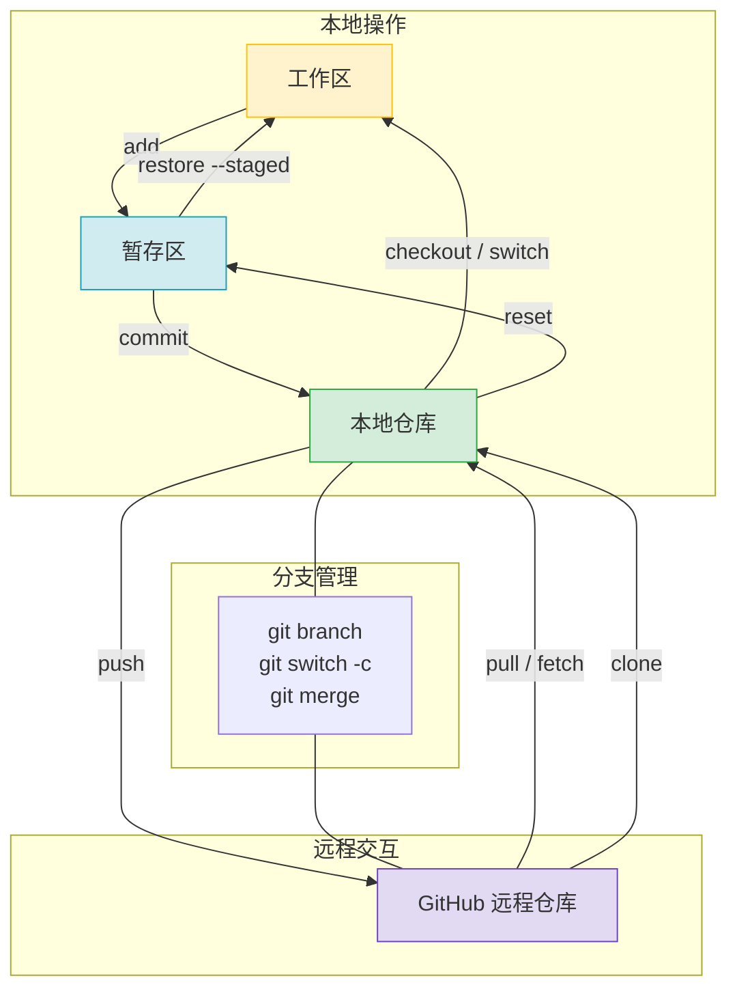
```mermaid
flowchart TB
    subgraph 本地操作
        WD2["工作区"] -->|"add"| SA2["暂存区"]
        SA2 -->|"commit"| LR2["本地仓库"]
        LR2 -->|"checkout / switch"| WD2
        LR2 -->|"reset"| SA2
        SA2 -->|"restore --staged"| WD2
    end

    subgraph 远程交互
        LR2 -->|"push"| RR2["GitHub 远程仓库"]
        RR2 -->|"pull / fetch"| LR2
        RR2 -->|"clone"| LR2
    end

    subgraph 分支管理
        BR["git branch<br/>git switch -c<br/>git merge"]
    end

    LR2 --- BR
    BR --- RR2

    style WD2 fill:#fff3cd,stroke:#ffc107
    style SA2 fill:#d1ecf1,stroke:#17a2b8
    style LR2 fill:#d4edda,stroke:#28a745
    style RR2 fill:#e2d9f3,stroke:#6f42c1
```

---

##  新人常见误区总结

| 误区 | 正确理解 |
|------|----------|
| ❌ `git add` 就是保存了 | ✅ `git add` 只是标记文件，`git commit` 才是真正生成版本 |
| ❌ `git push` 后别人立刻能看到 | ✅ 还需要在 GitHub 上发起 PR 并合并 |
| ❌ 直接在 `main` 分支上写代码 | ✅ 必须创建 `feature/xxx` 分支开发 |
| ❌ 改坏了代码就完了 | ✅ `git checkout` 可以回退到任意历史版本 |
| ❌ Git 和 GitHub 是一回事 | ✅ Git 是工具，GitHub 是网站平台 |

---


