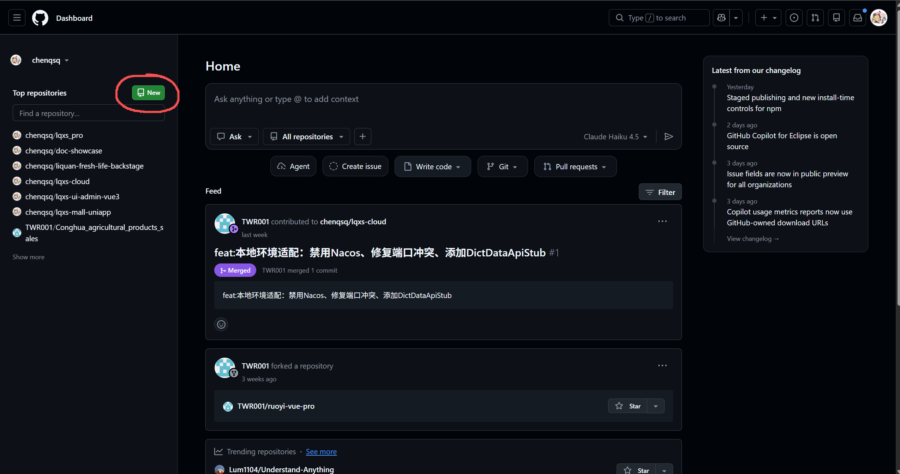
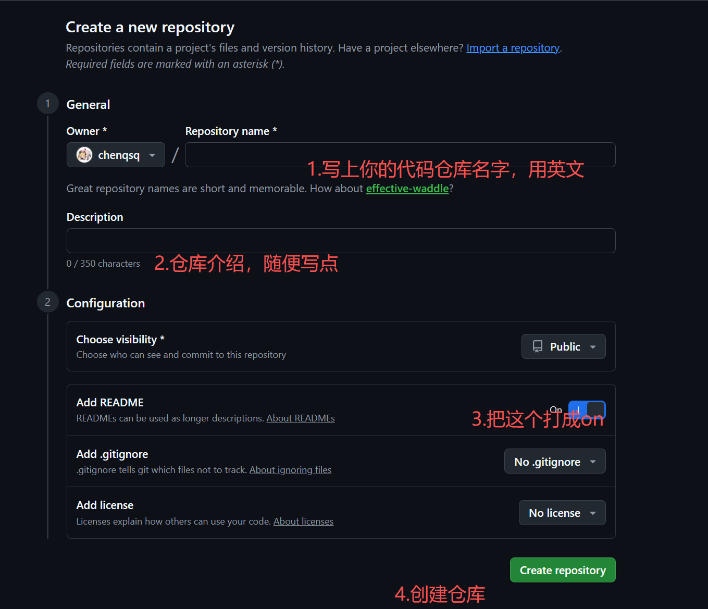
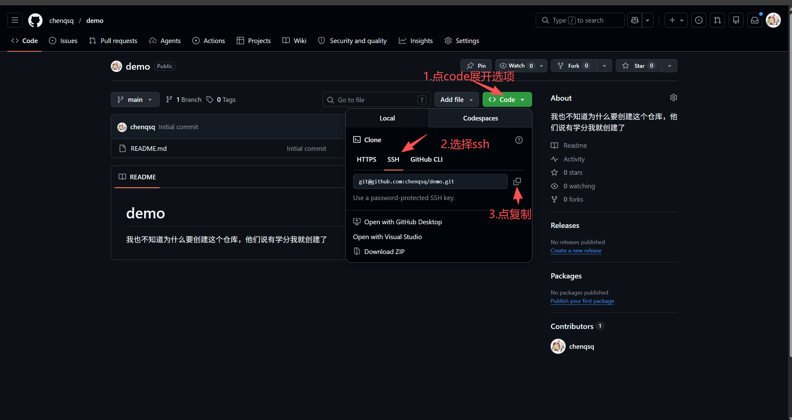
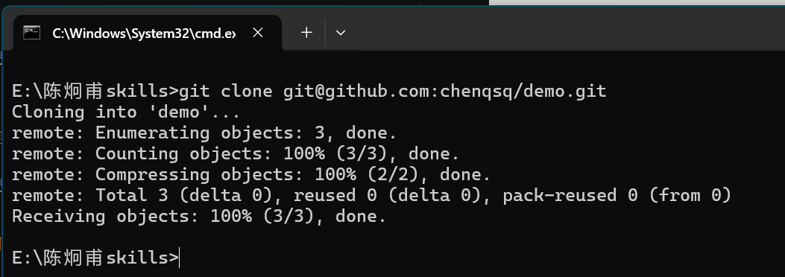
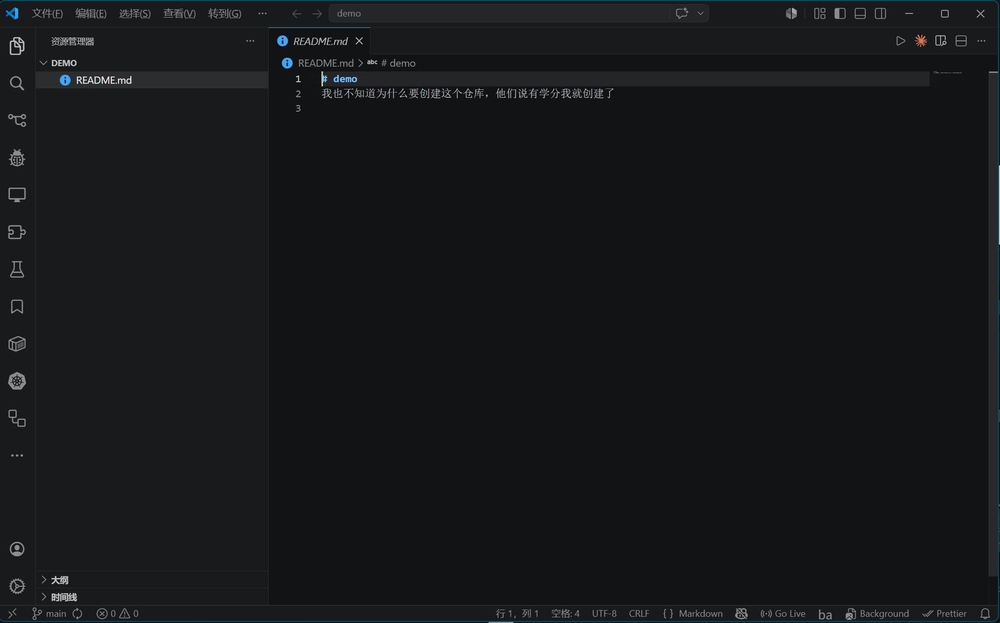

# git下载与GitHub注册
https://git-scm.com/?utm_source=chatgpt.com
https://github.com/?utm_source=chatgpt.com

# 一、Git 和 GitHub 是什么

## Git

Git 是代码版本管理工具,相当于游戏存档。

作用：

* 保存代码历史
* 回退版本
* 多人协作
* 上传 GitHub

---

## GitHub

[GitHub 官网](https://github.com?utm_source=chatgpt.com)

GitHub 是云端代码仓库平台。

作用：

* 存代码
* 团队协作
* 免费部署网页
* 做项目作品集

---

# 二、下载安装 Git

## 1. 打开 Git 官网

[Git 下载页面](https://git-scm.com/download/win?utm_source=chatgpt.com)

下载：

```txt id="h7x2za"
64-bit Git for Windows Setup
```

---

# 三、安装 Git（重点）

安装时：

## 一路 Next 即可

只改一个地方：

---

## PATH 环境变量（重点）

看到：

```txt id="uq08h4"
Adjusting your PATH environment
```

选择：

```txt id="x6p3of"
Git from the command line and also from 3rd-party software
```

意思：

> 直接把 Git 加入系统环境变量

这样：

* cmd 能用 git
* PowerShell 能用 git
* VSCode 能用 git
* 后面不用再手动配置环境变量

---

# 四、验证 Git 是否安装成功

安装完成后：

打开：

```txt id="w0rj2v"
cmd
```

输入：

```bash id="q0m65j"
git --version
```

看到：

```txt id="mmsi7l"
git version 2.xx.x
```

说明安装成功。

---

# 五、安装 VSCode（推荐）

## 下载

[VSCode 官网](https://code.visualstudio.com?utm_source=chatgpt.com)

---

## 安装建议

勾选：

```txt id="4vvf4q"
√ 添加到 PATH
√ 右键菜单打开
√ 注册 code 命令
```

---

# 六、注册 GitHub

## 打开 GitHub

[GitHub 官网](https://github.com?utm_source=chatgpt.com)

注册：

* 邮箱
* 用户名
* 密码

建议：

* 用户名用英文
* 后续会成为你的项目地址

例如：

```txt id="z1v5fk"
https://github.com/用户名
```

---

# 七、配置 Git（第一次必须做）

打开：

* CMD
* PowerShell
* VSCode终端
  都可以。

---

## 设置用户名

```bash id="a4q6m5"
git config --global user.name "你的名字"
```

例如：

```bash id="xwjlwm"
git config --global user.name "xiaoming"
```

---

## 设置邮箱（用你注册GitHub的邮箱）

```bash id="0mlmjlwm"
git config --global user.email "你的邮箱"
```

例如：

```bash id="dy19gr"
git config --global user.email "123@qq.com"
```

---

## 查看配置（看看你的用户名和密码有没有配置错）

```bash id="1vrxnp"
git config --list
```

---

# 八、配置 GitHub SSH（推荐）

现在 GitHub 基本不用密码推送了。

推荐 SSH。

---

## 生成 SSH Key

输入：

```bash id="hyhn5t"
ssh-keygen -t ed25519 -C "你的GitHub邮箱"
```

例如：

```bash id="mt4snm"
ssh-keygen -t ed25519 -C "123@qq.com"
```

---

## 一路回车

生成位置：

```txt id="0mr4dh"
C:\Users\用户名\.ssh
```

---

## 查看公钥


打开文件后复制全部内容。

---

# 九、添加 SSH Key 到 GitHub

打开设置：


---


## 把你刚刚复制到的ssh密钥粘贴到这里面


---

# 十、测试 SSH 是否成功

输入：

```bash id="7wx4i8"
ssh -T git@github.com
```

第一次输入：

```txt id="jlwmna"
yes
```

成功后会看到：

```txt id="1u8jlwm"
You've successfully authenticated
```

---

# 十一、创建 GitHub 仓库

GitHub 首页：



---


---

# 十二、克隆仓库到本地

复制仓库 SSH 地址：


---

自己新建一个文件夹，然后打开终端：


```bash id="8b6y8o"
git clone 仓库地址(刚刚复制的)
```


这样子就算成功了


在文件夹找到你的仓库

---

## 用vscode进入项目：



---

# 十三、Git 基础工作流（核心）


##  一、Git 基础命令

| 功能     | 命令                   | 作用            |
| ------ | -------------------- | ------------- |
| 查看版本   | `git --version`      | 查看 Git 是否安装成功 |
| 初始化仓库  | `git init`           | 创建 Git 仓库     |
| 克隆仓库   | `git clone 仓库地址`     | 下载远程仓库        |
| 查看状态   | `git status`         | 查看文件修改状态      |
| 添加全部文件 | `git add .`          | 添加所有修改        |
| 提交代码   | `git commit -m "说明"` | 提交版本          |
| 推送代码   | `git push`           | 上传代码到 GitHub  |
| 拉取代码   | `git pull`           | 拉取远程最新代码      |
| 查看历史   | `git log --oneline`  | 查看提交记录        |

---

##  二、Git 分支命令（重点）

| 功能        | 命令                    | 作用           |
| --------- | --------------------- | ------------ |
| 查看分支      | `git branch`          | 查看本地分支       |
| 查看远程分支    | `git branch -r`       | 查看远程分支       |
| 查看所有分支    | `git branch -a`       | 查看本地+远程      |
| 创建分支      | `git branch dev`      | 创建 dev 分支    |
| 切换分支      | `git checkout dev`    | 切换到 dev      |
| 创建并切换     | `git checkout -b dev` | 创建并切换分支      |
| 新版切换分支    | `git switch dev`      | 切换分支（新版推荐）   |
| 创建并切换（新版） | `git switch -c dev`   | 创建并切换        |
| 删除分支      | `git branch -d dev`   | 删除分支         |
| 强制删除      | `git branch -D dev`   | 强制删除分支       |
| 合并分支      | `git merge dev`       | 合并 dev 到当前分支 |

---

## 三、最标准的企业开发流程

---

## 1. 克隆项目

```bash id="n0e8v8"
git clone 仓库地址
```

---

## 2. 进入项目

```bash id="4utp2l"
cd 项目名
```

---

## 3. 查看当前分支

```bash id="7g4t3y"
git branch
```

---

## 4. 创建功能分支

例如开发登录功能：

```bash id="g7f1qv"
git checkout -b feature/login
```

或者新版：

```bash id="jlwmu8"
git switch -c feature/login
```

---

## 5. 开发代码

修改文件。

---

## 6. 查看状态

```bash id="jlwm19"
git status
```

---

## 7. 添加代码

```bash id="4iwnc0"
git add .
```

---

## 8. 提交代码

```bash id="jlwmc7"
git commit -m "完成登录页面"
```

---

## 9. 推送分支到 GitHub

```bash id="jlwm85"
git push origin feature/login
```

---

## 10. 在 GitHub 发起 PR（Pull Request）

也叫：

* 合并请求
* 代码审核

---

## 11. 合并到 main

项目负责人审核后：

```txt id="jlwmzi"
feature/login
→ main
```

---

# 四、分支规范（非常重要）

## 主分支

| 分支     | 作用   |
| ------ | ---- |
| `main` | 生产环境 |
| `dev`  | 开发环境 |

---

## 功能分支

| 分支              | 作用   |
| --------------- | ---- |
| `feature/login` | 登录功能 |
| `feature/user`  | 用户模块 |
| `feature/pay`   | 支付功能 |

---

## 修复分支

| 分支             | 作用       |
| -------------- | -------- |
| `hotfix/login` | 紧急修复登录问题 |

---

# 七、新人必须理解的 Git 思维

---

## main 分支

```txt id="jz5zsr"
正式版本
不能乱改
```

---

## feature 分支

```txt id="jlwm7m"
每个人开发自己的功能
互不影响
```

---

## merge

```txt id="jlwm9j"
把功能合并回主分支
```

